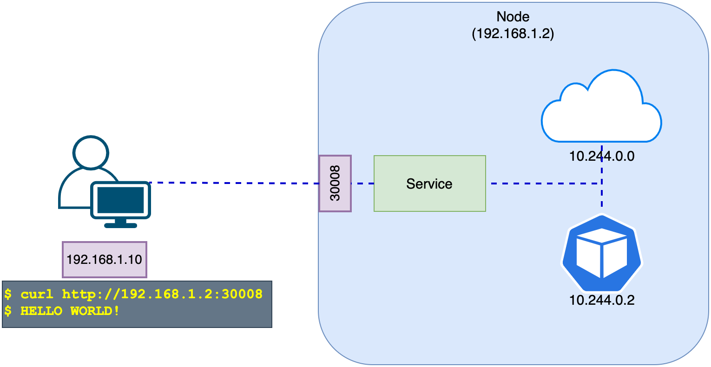
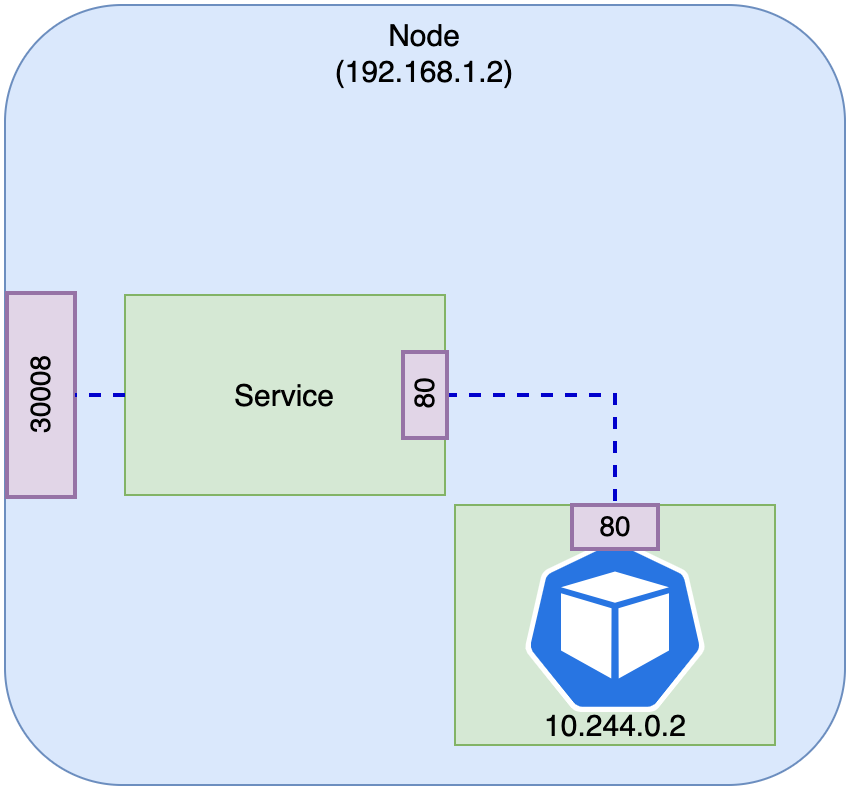

# Kubernetes Core Concepts

## Cluster Architecture

The purpose of Kubernetes is to host application in form of containers, in an automated fashion so that you can easily deploy as many instance of the application as required and easily enable communication between different services. At high level Kubernetes consist of control-plane and data-plane (nodes). Control plane is responsible for monitoring and managing nodes while nodes are actually carrying the workload. Using ships analogy, nodes are cargo ships while control-plane is the master ship. 


The worker node on the cluster are like cargo ships that can load containers.
The control plane is responsible for loading the the containers on the cargo ships, it plans how to load, identify the right ship, store information about them, monitor and track the location of containers on the cargo ships etc., This relates to master node. The master node is responsible for managing kubernetes cluster. The master node does all of these with control-plane components: 

* ETCD Cluster: Is a highly available key-value store which maintain information about the containers
* Scheduler: Identifies the right node on kubernetes to place a container on. Based on containers resource requirement, worker capacity or any other policy or constrains
* Node-controller: Responsible for onboarding new nodes into the cluster handling situations when nodes become unavailable or gets destroyed 
* Replication controller: Ensures that desired containers are running at all time on the replication group 
* Kube API Server: Is primary management component of kubernetes which is responsible for orchestrating all operations within cluster it exposes kubernetes API which is used by external users to perform management operations on the cluster, it also monitors state of cluster and perform actions based on that 
* Container runtime engine: such as docker it is installed on the all nodes including the master nodes to be able to run containers 
* `kubelet`: Is an agent that runs on each mode on a cluster, it listens for instructions from the kube-api server and deploys and destroys containers on the node, the kube-api server periodically fetches status report from `kubelet` to monitor the status of nodes and containers on them 
* Kube-proxy: Ensures that necessary rules are in place on the worker nodes to allow containers running on them to reach each other 


## ETCD

ETCD is a super fast and highly available key-value store. Whe you install and run it it will start a service that will listen on port 2379 by default you can the attach any client to ETCD to store and retrieve information. The default client that comes with it is ETCD control client, it is a CLI client for ETCD.

To store a key value pair run the following command which create an entry in the database with the given information:

```bash
./etcdctl set key1 value1
```
To retrive data run the following command, 
```bash
./etcdctl get key1
```

The ETCD stores information for Nodes, Pods, Configs, Secrets, Accounts, Roles, Role-bindings etc., Everything that comes from `kubectl get` is from ETCD cluster. Every change that we make to cluster such as adding addional nodes, deployment, pods and replicasets are updated in ETCD cluster. Only once it ios update in ETCD server then the change is considered to be complete. 

ETCD has different deployment mode depending how the cluster is set up:
Set up cluster from scratch: Then we deploy ETCD by downloading its binary, then configuring ETCD as a server in the master node.
For high availability we have to set up ETCD as a cluster 

Advertised client url: This is the address on which ETCD listens, it is on the IP of the server and on port 2379. This is the url that should be configured on the api server when it tries to reach ETCD server. 

Set up with `kubeadm`: In this deployment mode, `kubeadm` sets up ETCD as a pod in the kube-system namespace. We can explore ETCD database using ETCD control utility in this pod. 

To list all keys stored by kubernetes run the following command:

```bash
kubectl exec etcd-master -n kube-system etcdctl get / --prefix -keys-only
```

Kubernetes stores data in a specific directory structure
Root: is registry where we have various kubernetes constructs such as minions, pods, replicasets. deployments, roles, secrets, etc.,

```bash
/registry/apiregistration.k8s.io/apiservices/v1.
/registry/apiregistration.k8s.io/apiservices/v1.apps
/registry/apiregistration.k8s.io/apiservices/v1.authentications.k8s.io
...
```
In high availability environment we have multiple master nodes in cluster, then we have multiple ETCD instances across master nodes.

In this case we have to make sure ETCD instances know about eachother by setting up the right parameter in ETCD service configuration in `--initial-cluster controller-0-https://{CONTROLLER0_IP}:2380,controller-1-https://{CONTROLLER1_IP}:2380`


### ETCD commands

ETCDCTL can interact with ETCD Server using 2 API versions - Version 2 and Version 3.  By default its set to use Version 2. Each version has different sets of commands.

For example ETCDCTL version 2 supports the following commands:
```bash
etcdctl backup
etcdctl cluster-health
etcdctl mk
etcdctl mkdir
etcdctl set
```

Whereas the commands are different in version 3
```bash
etcdctl snapshot save 
etcdctl endpoint health
etcdctl get
etcdctl put
```

To set the right version of API set the environment variable ETCDCTL_API command
```bash
export ETCDCTL_API=3
```

Apart from that, you must also specify path to certificate files so that ETCDCTL can authenticate to the ETCD API Server. The certificate files are available in the etcd-master at the following path.
```bash
--cacert /etc/kubernetes/pki/etcd/ca.crt     
--cert /etc/kubernetes/pki/etcd/server.crt     
--key /etc/kubernetes/pki/etcd/server.key
```
Below is the final form:


```bash
kubectl exec etcd-master -n kube-system -- sh -c "ETCDCTL_API=3 etcdctl get / --prefix --keys-only --limit=10 --cacert /etc/kubernetes/pki/etcd/ca.crt --cert /etc/kubernetes/pki/etcd/server.crt  --key /etc/kubernetes/pki/etcd/server.key" 
```

## Kube-API Server

It is the primary management component in kubernetes. When you run `kubectl` command it is in fact reaching to kube-api server. The kube-api server first authenticates the requests ans validates it, then retrieves data from ETCD cluster and response back with the information. The API can also be invoked directly.

For instance when you create a pod, in this case the api server creates a pod object without assigning it to a node and place the information to ETCD server then updates the user that pod has been created. 

The scheduler continuously monitors the api server and realise there's a new pod with no node assigned, the scheduler identifies the right node to place the new pod on. And communicates that back to the api server, then api server updates the information in the etcd cluster. The api server then passes the information to the `kubelet` in worker node. The `kubelet` creates the pod in the node and instructs the container runtime engine to deploy the application image. Once done the `kubelet` updates the status back to the api server and api server updates the data in the etcd cluster. A similar pattern is followed every time a change is requested, the kube-api server is at the center of all tasks that need to be performed in the kubernetes cluster. 


Kube-API server is responsible for following tasks:
1. Authenticating requests
1. Validating requests
1. Retrieving data in the ETCD data store (the only component that interacts directly with ETCD)
1. Updating data in the ETCD data store
1. Scheduler: Uses api server to perform update in the cluster in their respective areas
1. `kubelet`: Uses api server to perform update in the cluster in their respective areas


> If we set up cluster with `kubeadm` none of these maters, but if we set it up from scratch then the kube-api server need to be installed with its binary in kubernetes release page.

To view kube-api server  options in an existing cluster, with `kubeadm`, the kube-api server is deployed as a pod in kube-system namespace on the master node 
```bash
kubectl get pods -n kube-system
```

You can see the option in the kube-apiserver.yaml manifest file
```bash
cat /etc/kubernetes/manifests/kube-apiserver.yaml
```
In a none `kubeadm` set up you can view the options located in
```bash
cat /etc/systemd/system/kube-apiserver.service
```
You can also see the running process and respective options by searching kube-apiserver in the running processes
```bash
ps -aux | grep kube-apiserver
```

## Kube Controller Manager

It manages various controllers in kubernetes, in the kubernetes terms a controller is a process that continuously monitors state of various components within the system and works towards bringing the whole system towards the desired functioning state. 

Node controller: is responsible of monitoring state of nodes and take necessary actions to keep the nodes running, it does that through the kube-api server. The node controller takes the status of nodes every 5 seconds for health monitoring. If it stops receiving heartbeats from a node, the node is marked as unreachable after waiting for 40 seconds. The it gives the node 5 minutes to come back up, if it doesn't it removes the pod on that node and provisions them on the healthy one if the pods are part of a replicaset. 

Replication controller: It is responsible for monitoring state of replicasets and ensuring that the desired number of pods are available at all time within the set. if a pod dies, it creates another one 


There are many more controllers in kubernetes such as endpoint, deployment, jobs etc., controller. All of them are packages within Kube-Controller Manager. To view them:

If the cluster is set up with `kubeadm`:

kubectl get pods -n kube-system

`kubeadm` deploys the the kube-controller-manager as a pod

```bash
cat /etc/kubernetes/manifests/kube-controller-manager.yaml
```

In a none `kubeadm` set up you can view the options located in
```bash
cat /etc/systemd/system/kube-controller-manager.service
```
You can also see the running process and respective options by searching kube-controller-manager in the running processes
```bash
ps -aux | grep kube-controller-manager
```


## Kube Scheduler

The scheduler is only responsible for deciding which pod goes on which node. It doesn't place the pod on the node by itself, that's the job of `kubelet`. The reason that we need a scheduler is because we're dealing with many nodes and much more containers, we want to make sure a container ends up on the right node. The scheduler looks at each pod and tries to find the best node for it. A pod has set of cpu and memory requirements the scheduler goes through two phases to identify best node.
1. The scheduler tries to filter out the nodes that do not fit the profile for this pod, for example the node that do not have sufficient cpu and memory requested by the pod
1. The scheduler ranks the leftover nodes to identify the best fit for the pod it uses a priority function to assign a score on a scale of 0 to 10 to nodes. For example it calculate the amount of resources that will be free after assigning the pod on the node if the leftover resource is higher the node scores higher. 

If the cluster is set up with `kubeadm`:

kubectl get pods -n kube-system

`kubeadm` deploys the the kube-scheduler as a pod

```bash
cat /etc/kubernetes/manifests/kube-scheduler.yaml
```

In a none `kubeadm` set up you can view the options located in
```bash
cat /etc/systemd/system/kube-scheduler.service
```
You can also see the running process and respective options by searching kube-scheduler in the running processes
```bash
ps -aux | grep kube-scheduler
```

## Kubelet

The kubelet in the kubernetes worker node, registers the node with the kubernetes cluster. When it receives instructions to load a container or pod on the node it request the container runtime engine to pull the require an image and run the instance. The kubelet then continue to monitor the state of the pod and containers in it and reports to the kube-api server on a timely basis.

If the cluster is set up with `kubeadm` it does not automatically deploy the kubelet, you must always manually install install kubelet:

You must download the installer, extract it and run it as a service. 


You can see the running process and respective options by searching kubelet in the running processes
```bash
ps -aux | grep kubelet
```

## Kube-proxy

Within kubernetes cluster every pod can reach every other pod, this is accomplished by deploying a pod networking solution in the cluster. A pod network is an internal virtual network that spans across all the nodes in the cluster to which all the pods connect to. If we have a web application deployed on the node 1 and database deployed on the node 2. The web app can reach the database simply by using the IP of the pod. But there's no guarantee that the IP of the database will stay the same. A better way for the web application to access the database is using services so we create a service to expose the database across the cluster. The web application can now access the database using the name of service. The service also gets an IP address assigned to it. Whenever a pod tries to reach the service using its IP or name it forward the traffic to the backend pod in this case the database. 

A service cannot join the pod network because services in kubernetes are not an actual thing, it is not a container, it does not have any interfaces or an actively listening process. It is a virtual component that only lives in kubernetes memory. Services are accessible across kubernetes cluster from any nodes, this is achieved by kube-proxy.

Kube-proxy is a process that runs on each kubernetes nodes, its job to look for new services and every time a new service is created it creates the appropriate rule to on each node to forward the traffic to those services to the backend pods. One way it does this is by using IP table rules, simply mapping between IP of service and IP of pods


If the cluster is set up with `kubeadm`:

```bash
kubectl get pods -n kube-system
```
`kubeadm` deploys the the kube-proxy as a pod, in fact it is deployed as daemonset so a single pod is always deployed on each node of cluster:
```bash
kubectl get daemonset -n kube-system
```

```bash
cat /etc/kubernetes/manifests/kube-proxy.yaml
```

In a none `kubeadm` set up you can view the options located in
```bash
cat /etc/systemd/system/kube-proxy.service
```
You can also see the running process and respective options by searching kube-proxy in the running processes
```bash
ps -aux | grep kube-proxy
```

## Pods

Once application already has been developed and built into docker images, and the build artifact is available in a container registry, kubernetes can pull the image down and deploy the application in form of containers on a set of machines that are configured as worker nodes in a cluster. The containers are encapsulated into a kubernetes object known as pods. A pod is a single instance of an application and is the smallest object that you can create in kubernetes.

For scaling scenarios we bring up new pod of the same instance of the application, if the node has no capacity left the new pods will be deployed in a separate node. Pods have 1-to-1 relation with applications. We are not restricted to have single container in a single pod, for  instance we can have a helper container to support the some additional tasks that a web application needs like processing files uploaded etc., and we might want that these helper containers to live alongside of the application (from application life-cycle standpoint). The two containers can communicated with each other by referring to each other via `localhost` since they share the same network space as well as sharing the same storage space. 

`kubectl run nginx` command deploys a docker container by creating a pod. At first creates a pod automatically and deploys an instance of `nginx` docker image, for the image we have to specify image name using `--image` parameter. The `kubectl get pods` helps to see list of pods. 

## Pods with YAML

Kubernetes uses yaml files as input for creation of objects such as pods, replicas, deployments, etc., all of these follow similar structure, a kubernetes definition files always has four top-level fields `apiVersion`, `kind`, `metadata` and `spec`:

```yml
apiVersion:

kind:

metadata:

spec:
```
These are root level properties and they are required in the yaml manifest. 

* `apiVersion`: The version of kubernetes api we're using to create the object, depending on what we're creating this need to be set respectively
    * POD `v1`
    * Service `v1`
    * ReplicaSet `apps/v1`
    * Deployment `apps/v1`
* `kind`: The kind refers to the type of object we're trying to create can be `Pod`, `Service`, `ReplicaSet`, `Deployment` etc.,
* `metadata` is the data about the object, like its name, labels etc., this is in a form of dictionary. Everything under metadata is indented and the number of spaces does not matter. Labels is also a dictionary and it can have any arbitrary key/values.
* `spec` is a dictionary containing information n about the image
    * `containers` is list or array as the pods can have multiple containers in them. the dash `-` before the name indicates that this is an item in the list. 

```yml
apiVersion: v1
kind: Pod
metadata:
  name: myapp-pod
  labels:
    app: myapp
    tier: front-end
spec:
  containers:
  - name: nginx-container
    image: nginx
```

To deploy the yaml manifest run
```bash
kubectl create -f pod-definition.yml
```
or
```bash
kubectl apply -f pod-definition.yml
```

>Create an apply behave the same

To see detailed information about the pod run:
```bash
kubectl describe pod myapp-pod
```

[Pods labs](labs/01_pod_lab.md)

## ReplicaSets

Controllers are the brain behind kubernetes, they are processes that monitor kubernetes objects and respond accordingly. A specific type of controller is replication controller.

If we have a single pod running our application, in case our application crashes for whatever reason, the pod will fail. To prevent users to loose access to application we'd like to have more than one instance of our pod running at the same time. That way if one fails the application will be still running on the other one. The replication controller helps us to run multiple instances of a single pod in the kubernetes cluster thus providing high availability. That does not mean we cannot use replication controller if we plan to have a single pod. If we have single pod the replication controller will bring a new one up every time that existing one fails. Replication controller ensures that specified number of pods are running all the time if it is 1 or 100.

Replication controller also helps to share the load across multiple pods, if the node runs out of resource the new pods will be deployed in other nodes with sharing the same replication controller. Meaning the replication controller can span across nodes.

Replication controller and Replica Set both have the same purpose but they are not the same. Replication controller is the legacy version and is being replaces by replica sets. 

`spec` in replicasets simply contains the definition of pods as a nested manifests.
`replicas` contains the number of replicas

```yaml
apiVersion: apps/v1
kind: ReplicaSet
metadata:
  name: myapp-rs
  labels:
    app: myapp
    tier: front-end
spec:
  template:
    metadata:
    name: myapp-pod
    labels:
      app: myapp
      tier: front-end
    spec:
      containers:
      - name: nginx-container
        image: nginx
  replicas: 3
  selector:
    matchLabels:
      tier: front-end
```

```bash
kubectl create -f rs-definition.yaml
```
```bash
kubectl get replicasets
```
```bash
kubectl get pods
```

>if `apiVersion` is set wrongly you'll get an error as `error: unable to recognize "rs-definition.yaml": no matches for /, Kind=ReplicaSet`

`selector`: Helps the replicasets to identify what pods fall under it, unlike replication controllers, replicasets can manage pods that were not created as part of replicasets creation. The `matchLabels` is the primary function that tells replicasets which pods falls under its control.

### Labels & Selectors
Imagine we deployed three instances of a front-end web application as three pods, we would like to create a replicaset to ensure we have three active pods at any time. The replicaset is in fact a process that monitors the pods and in case any of them fail, it'll bring up a new one. replicaset uses labels as a filter to identify pods that need to be managed. 

In case we have created our pods with a different manifest (without replicasets) and we would like to put them under control of a replicaset, in this case when replicaset is created it is not going to create a new pods as pods with matching labels are already created but we still have to provide the pod definition under template section. This is because the replicaset has to know what pods to monitor.


### Scaling Replicasets
if we want to scale a replicaset to a higher number of pods
1. We can update the number of replicas in the replicaset's definition file we run `kubectl replace -f rs-definition.yaml`
1. Run `kubectl scale --replicas=6 -f rs-definition.yaml` or `kubectl scale --replicas=6 replicaset myapp-replicaset` the first option does not update the number of replicas in the file
1. update automatically based on load


[ReplicaSets labs](labs/02_replicaset_lab.md)

## Deployments

Imagine we have a web server that need to be deployed in the production environment. And for scalability reasons we need multiple instances of this web server running. Secondly wwe also want that whenever newer version of the  application image becomes available in the container registry, we would like to upgrade our containers seamlessly. We also might want to not upgrade everything all at once, rather one after another, known as rolling updates. In case one of the upgrades results in an unexpected error and we want to undo the changes, we would like to be able to roll back the changes that were carried out. Lastly we also want to be able to pause the deployment to be able to apply changes on infrastructure then resume the deployment.

All of these are available within kubernetes deployments. Deployment comes higher in the hierarchy after ReplicaSets. Meaning it contains replicasets and pods. The deployment help us to change underlying instances using rolling updates, undo, pause and resume changes if required. 

### Deployment definition file


```yaml
apiVersion: apps/v1
kind: Deployment
metadata:
  name: myapp-d
  labels:
    app: myapp
    tier: front-end
spec:
  template:
    metadata:
    name: myapp-pod
    labels:
      app: myapp
      tier: front-end
    spec:
      containers:
      - name: nginx-container
        image: nginx
  replicas: 3
  selector:
    matchLabels:
      tier: front-end
```

```bash
kubectl create -f d-definition.yaml
```
```bash
kubectl get deployments
```
```bash
kubectl get replicasets
```
```bash
kubectl get pods
```

 The only difference to replicaset is that, deployment will create a new kubernetes object called deployment. 

 To get the all objects at once, run:
 ```bash
kubectl get all
```

[Deployments labs](labs/03_deployment_lab.md)

## Exam Tip
Here's a tip!

It is a bit difficult to create and edit YAML files. Especially in the CLI. During the exam, you might find it difficult to copy and paste YAML files from browser to terminal. Using the `kubectl run` command can help in generating a YAML template. And sometimes, you can even get away with just the kubectl run command without having to create a YAML file at all. For example, if you were asked to create a pod or deployment with specific name and image you can simply run the kubectl run command.

Use the below set of commands:

Create an NGINX Pod
```bash
kubectl run nginx --image=nginx
```
Generate POD Manifest YAML file (-o yaml). Don't create it(--dry-run)
```bash
kubectl run nginx --image=nginx --dry-run=client -o yaml
```
Create a deployment
```bash
kubectl create deployment --image=nginx nginx
```
Generate Deployment YAML file (-o yaml). Don't create it(--dry-run)
```bash
kubectl create deployment --image=nginx nginx --dry-run=client -o yaml
```
Generate Deployment YAML file (-o yaml). Don't create it(--dry-run) with 4 Replicas (--replicas=4)
```bash
kubectl create deployment --image=nginx nginx --dry-run=client -o yaml > nginx-deployment.yaml
```
Save it to a file, make necessary changes to the file (for example, adding more replicas) and then create the deployment.
```bash
kubectl create -f nginx-deployment.yaml
```
OR

In k8s version 1.19+, we can specify the --replicas option to create a deployment with 4 replicas.
```bash
kubectl create deployment --image=nginx nginx --replicas=4 --dry-run=client -o yaml > nginx-deployment.yaml
```

## Namespaces

Best way to understand namespaces is family analogy, imagine there are two families, Bandpeys and Smiths. They both have a daughter name Emy. In the house they refer to Emy by name but if Bandpeys wnt to talk about Smith's Emy they would refer to her with full name (Emy Smith). Each of these families have their own set of rules that defines who does what. As well as having their own resources that they can consume. 

The `default` namespace is created automatically when the cluster is first set up. Every pods and services that are required by kubernetes internal set up will be under `kube-system` namespace. `kube-public` is another namespace that is created by kubernetes  automatically, this will hold resources that should be made available to all users. Namespaces can have specific policies defined as well as quota limits. 

If we want to connect to a database within the namespace we can simply refer to its name
```bash
mysql.connect("db-service")
```
However if a resource wants to connect to a database in another namespace (`dev` for instance) we must append the namespace on service name:
```bash
mysql.connect("db-service.dev.svc.cluster.local")
```

When a service is created a dns entry is added automatically in this format. `cluster.local` is the default domain name of kubernetes cluster. `svc` is the subdomain for service, `dev` is namespace and `db-service` is the name of the service itself.

`kubectl get pods` will list the pods in the default namespace. To get the pods in another namespace use the following:

```bash
kubectl get pods --namespace=kube-system
```

If th namespace is not mentioned in pod manifest file, the pod will be created in the default namespace. In order to create a pod in a name space use the following:

```bash
kubectl create -f pod-definition.yml --namespace=dev
```

or the following in pod manifest:

```yml
apiVersion: v1
kind: Pod
metadata:
  name: myapp-pod
  namespace: dev
  labels:
    app: myapp
    tier: front-end
spec:
  containers:
  - name: nginx-container
    image: nginx
```

In order to create a new namespace like any object in kubernetes we can use the namespace definition file:
```yml
apiVersion: v1
kind: Namespace
metadata:
  name: dev
```

```bash
kubectl create -f namespace-dev.yml
```
or 

```bash
kubectl create namespace ev
```

In order to switch  to a namespace permanently

```bash
kubectl config set-context $(kubectl config current-context) --namespace dev
```
This command first identifies the current context and then sets the context to the one with desired namespace.

To view resources in all namespaces run:

```bash
kubectl get pods --all-namespaces
```

To create a resource quota start by creating a definition file:

```yml
apiVersion: v1
kind: ResourceQuota
metadata:
  name: compute-quota
  namespace: dev
spec:
  hard:
    pods: "10"
    requests.cpu: "4"
    requests.memory: 5Gi
    limits.cpu: "10"
    limits.memory: 10Gi
```

```bash
kubectl create -f compute-quota.yaml
```

## Services

Kubernetes services enable communication between various components of the application within and outside of kubernetes cluster. It is services that enable connectivity between groups of pods. For instance enabling frontend applications to end users, also enabling communication between backend and frontend pods, and helps establishing connectivity to an external data source. Service provide loose coupling in a microservice application. 

Let's assume we have deployed a pod having a web application on it, how an external user access that web page?

The kubernetes node has an IP address of `192.168.1.2`, imagine user is in the same network, with IP of `192.168.1.10` and the internal pod network is in the range of `10.244.0.0` clearly the user cannot ping or access the pod at address `10.244.0.15` as it is in a separate network. If we were to ssh to the kubernetes node, from  the node we would be able to access the pod by running `curl http://10.244.0.2`. But we want to access the pod from an external network, without having to ssh into the node and simply by IP address of the kubernetes node. We need something in the middle that help us map request from the laptop through the node to the pod. The kubernetes service is an object which one of it's use case it to listen to a port on the node and forward request on that port to a port on the pod running an application. This type of service is know as a nodeport service. 



### Nodeport
In nodeport, there are three ports involved:
* The port on the pod where the actual web server is running is `80` and it is refereed to as target port. Because that's where the service forwards the requests to.
* The port on the service itself, the service in fact is like a virtual server inside the node. Inside the cluster it has its own IP address and that IP address is called the ClUSTER-IP of the service.
* The port on node itself, which we use to access the web service externally, that is known as nodeport. It is set to `30008` because nodeports can only be in the valid range which by default is from `30000` to `32767` 



For creation f a service we'll use a definition file:

```yml
apiVersion: v1
kind: Service
metadata:
  name: my-service
spec:
  type:  NodePort
  ports: 
  - targetPort: 80
    port: 80
    nodePort: 30008
  selector:
    app: myapp
    tier: front-end
```

```bash
kubectl create -f service-definition.yml 
```
```bash
kubectl get services


will give us the ClUSTER-IP and nodeport and port so we can access it curl
```

```bash
curl http://192.168.1.2:30008
```

`ports` is an array, so we have have multiple such port mapping within a single service. 
For connecting the service to the pod, we will use labels ans selector to link these together. We simply pull the labels from the pod definition file ad place it under the selector section .

In production environment we have multiple pods,they have different IP addresses and they all have same labels with the key `app` and `tier` these label values are use as selector during creation of a service. The service select all the pods as endpoints to forward the external request coming from the user. The service acts as a built-in load balancer to distribute the load across the pods and there's no magical algorithm behind it, it just simply distribute the requests randomly. 

If the pods are distributed across multiple nodes, once we create a service without doing any additional setup kubernetes automatically spans the service across all nodes. In this  case we can access the application using the IP of each node.

### ClusterIP
Assuming an application would have frontend, backend and persistent layer, what is the right way to establish connectivity between the different tier of an  application?


The pods all have an IP address assign to them but these IPs as we know are not static.  A kubernetes service can help us to group the service together, and provide a single interface to access the pods in a group. Each service gets an IP and name assign to it, and hat is the name should be used by other pods to access the service. This type of service is know as ClusterIP.

For creation f a ClusterIP:

```yml
apiVersion: v1
kind: Service
metadata:
  name: my-service
spec:
  type:  ClusterIP
  ports: 
  - targetPort: 80
    port: 80
  selector:
    app: myapp
    tier: back-end
```

### LoadBalancer

Once pods are deployed inside multiple nodes we will end up with multiple urls to access the application, one solution might be setting a up an external load balancer  and then configure it to route the traffic to different nodes. If we were on a cloud provider we could leverage a native load balancer, kubernetes has the capability of connecting to native load balancer of major cloud providers.

All we have to do is to set the  service type for the front-end services from NodePort tp LoadBalancer. If the support for load balancer is not possible in the cloud provider it'll have same effect as NodePort.


## Infrastructure as Code

General approach towards IaC boils down into imperative and declarative. In the imperative world we provide the step by step instructions on how to set up an desired infrastructure, in the declarative world we describe our desired infrastructure the system will provision it for us. Tools like ansible, or terraform falls into declarative category.

### Imperative kubernetes commands

Create objects
* `kubectl run --image=nginx nginx`
* `kubectl create deployment --image=nginx nginx`
* `kubectl expose deployment nginx --port 80`

Update Objects
* `kubectl edit deployment nginx`
* `kubectl scale deployment nginx --replicas=5`
* `kubectl set image deployment nginx nginx=nginx:1.18`
* `kubectl create -f nginx.yml`
* `kubectl replace -f nginx.yml`
* `kubectl delete -f nginx.yml`
### Declarative kubernetes commands
Alternatively we can define the desired infrastructure and with apply command, kubernetes can decide by itself what need to be done to bring the infrastructure to the desired state. 
* `kubectl apply -f nginx.yml`

For creating, deleting and updating objects we'll run apply command


### Imperative Commands with Kubectl
While you would be working mostly the declarative way - using definition files, imperative commands can help in getting one time tasks done quickly, as well as generate a definition template easily.

`--dry-run`: By default as soon as the command is run, the resource will be created. If you simply want to test your command , use the `--dry-run=client` option. This will not create the resource, instead, tell you whether the resource can be created and if your command is right.

`-o yaml`: This will output the resource definition in YAML format on screen.

Use the above two in combination to generate a resource definition file quickly, that you can then modify and create resources as required, instead of creating the files from scratch.

#### POD
Create an NGINX Pod
```bash
kubectl run nginx --image=nginx
```


Generate POD Manifest YAML file (`-o yaml`). Don't create it(`--dry-run`)
```bash
kubectl run nginx --image=nginx --dry-run=client -o yaml
```


#### Deployment
Create a deployment
```bash
kubectl create deployment --image=nginx nginx
```


Generate Deployment YAML file (`-o yaml`). Don't create it`(--dry-run`)
```bash
kubectl create deployment --image=nginx nginx --dry-run=client -o yaml
```


Generate Deployment with 4 Replicas
```bash
kubectl create deployment nginx --image=nginx --replicas=4
```


You can also scale a deployment using the kubectl scale command.
```bash
kubectl scale deployment nginx --replicas=4
```
Another way to do this is to save the YAML definition to a file and modify
```bash
kubectl create deployment nginx --image=nginx --dry-run=client -o yaml > nginx-deployment.yaml
```


You can then update the YAML file with the replicas or any other field before creating the deployment.

#### Service
Create a Service named redis-service of type ClusterIP to expose pod redis on port 6379
```bash
kubectl expose pod redis --port=6379 --name redis-service --dry-run=client -o yaml
```
>This will automatically use the pod's labels as selectors

Or
```bash
kubectl create service clusterip redis --tcp=6379:6379 --dry-run=client -o yaml 
```
>This will not use the pods labels as selectors, instead it will assume selectors as app=redis. You cannot pass in selectors as an option. So it does not work very well if your pod has a different label set. So generate the file and modify the selectors before creating the service


Create a Service named nginx of type NodePort to expose pod nginx's port 80 on port 30080 on the nodes:
```bash
kubectl expose pod nginx --type=NodePort --port=80 --name=nginx-service --dry-run=client -o yaml
```
>This will automatically use the pod's labels as selectors, but you cannot specify the node port. You have to generate a definition file and then add the node port in manually before creating the service with the pod.

Or
```bash
kubectl create service nodeport nginx --tcp=80:80 --node-port=30080 --dry-run=client -o yaml
```
>This will not use the pods labels as selectors

Both the above commands have their own challenges. While one of it cannot accept a selector the other cannot accept a node port. It's better going with the kubectl expose command. If you need to specify a node port, generate a definition file using the same command and manually input the nodeport before creating the service.

